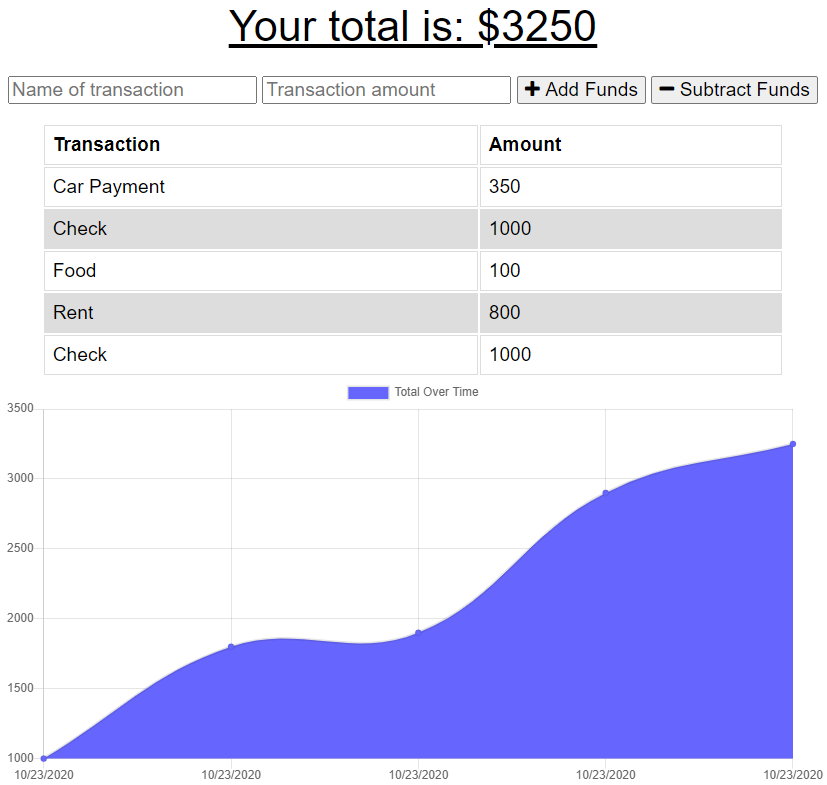
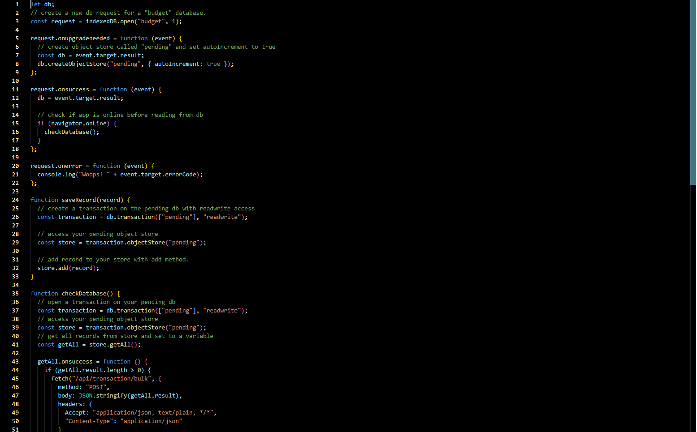

# Tracker of Budgets

## Description

This application will keep track of your withdrawals and deposits without a data/internet connection.

## Installation

This application is deployed on heroku.com, but can also be installed to your desktop or phone.

## Usage

The user can add deposits or withdrawals online or offline and they will be stored to the IndexedDB.

## License

This project uses the MIT_License license.

## Contributers

Node Mongoose MongoDB Atlas Heroku HTML JS CSS

## Images

## Questions

If you have any questions or suggestions, please contact me here:
[oscar.oses.1127@gmail.com](oscar.oses.1127@gmail.com)
